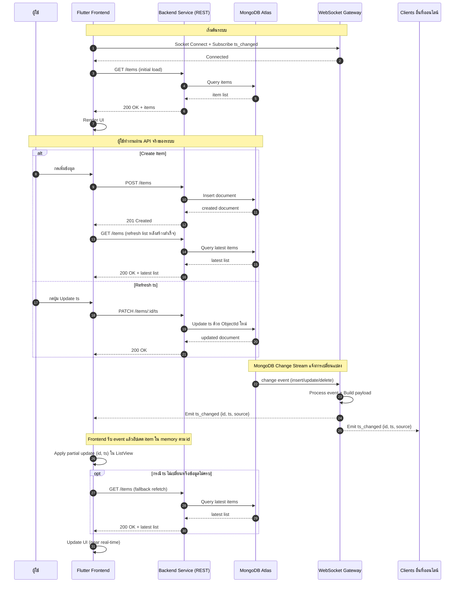

# Realtime Event System - End-to-End Architecture (ภาพรวมทั้ง 3 Services)

เอกสารนี้รวมภาพการทำงานของทั้งระบบแบบ End-to-End โดยให้เห็นการทำงานร่วมกันของ:
- Flutter Frontend
- Backend Service (NestJS REST API)
- WebSocket Gateway Service (NestJS + Socket.IO)
- MongoDB Atlas (Change Stream)

## สารบัญ
1. [Sequence Diagram (End-to-End รวมทั้งระบบ)](#sequence-diagram-end-to-end-รวมทั้งระบบ)
2. [Flowchart (End-to-End รวมทั้งระบบ)](#flowchart-end-to-end-รวมทั้งระบบ)
3. [คำอธิบายการไหลของข้อมูล](#คำอธิบายการไหลของข้อมูล)

---

## Sequence Diagram (End-to-End รวมทั้งระบบ)



---

## Flowchart (End-to-End รวมทั้งระบบ)

```mermaid
flowchart TD
    A([Start: ผู้ใช้เปิดแอป]) --> B[Flutter Frontend เริ่มทำงาน]
    B --> C[เชื่อมต่อ WebSocket Gateway\nSubscribe ts_changed]
    C --> D[โหลดข้อมูลเริ่มต้น\nGET /items -> Backend]
    D --> E[Backend Query MongoDB]
    E --> F[แสดงรายการบน UI]

    F --> G{ผู้ใช้ทำอะไรต่อ}
    G -->|Create| H[POST /items ไป Backend]
    G -->|Refresh ts| I[PATCH /items/:id/ts ไป Backend]
    G -->|Read| K[GET /items ไป Backend]

    H --> L[MongoDB เขียนข้อมูล]
    I --> L
    K --> M[MongoDB อ่านข้อมูล]

    L --> N[MongoDB Change Stream Trigger]
    N --> O[Gateway รับ Event\nprocess + emit ts_changed {id, ts, source}]
    O --> P[Frontend ที่ออนไลน์ทั้งหมดได้รับ ts_changed]
    P --> Q[แต่ละ Frontend อัปเดต item ใน memory ตาม id]
    Q --> Q1{ต้อง fallback refetch ไหม}
    Q1 -->|ใช่| M
    Q1 -->|ไม่| S

    M --> R[Backend ส่งข้อมูลล่าสุดกลับ]
    R --> S[Flutter Update UI ให้ตรงกัน]
    S --> G

    style A fill:#dff7df
    style O fill:#ffe3e3
    style P fill:#ffe3e3
    style S fill:#dfefff
```

---

## คำอธิบายการไหลของข้อมูล

1. Frontend เชื่อมต่อทั้ง REST และ WebSocket ตั้งแต่เริ่มต้น
2. API หลักที่ใช้คือ `POST /items`, `GET /items`, `PATCH /items/:id/ts`
3. MongoDB Change Stream แจ้ง Gateway เมื่อข้อมูลเปลี่ยน
4. Gateway broadcast `ts_changed` payload (`id`, `ts`, `source`) ไปยังทุก client ที่ออนไลน์
5. Frontend ปกติจะอัปเดตข้อมูลใน memory จาก event โดยไม่ต้อง refetch ทุกครั้ง
6. Frontend จะ fallback refetch เฉพาะบางกรณี (เช่นข้อมูลไม่ครบหรือ ts ไม่เปลี่ยนตามคาด)
7. UI ของทุก client จึง sync ตรงกันแบบ near real-time

ผลลัพธ์คือเห็นภาพรวมการทำงานของทั้ง 3 services ชัดเจนใน flow เดียวแบบ End-to-End
