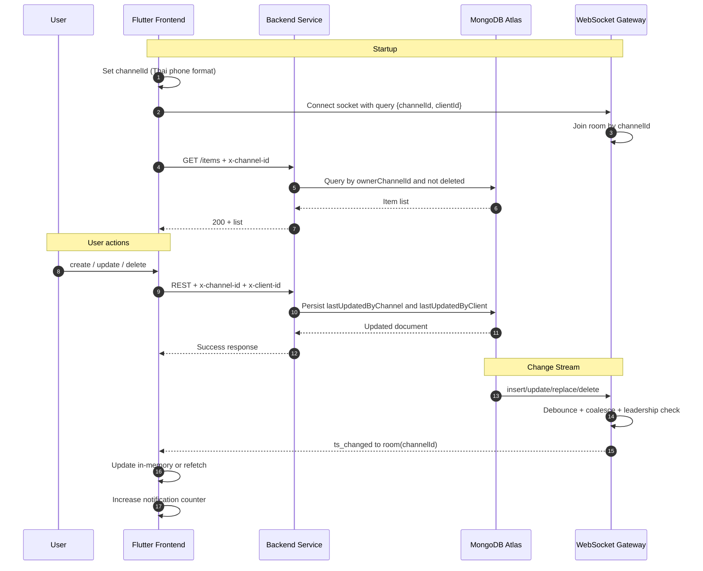

# สถาปัตยกรรมระบบ Realtime Event System

เอกสารนี้อธิบายภาพรวม End-to-End ของ Frontend, Backend, Gateway และ MongoDB

## Sequence Diagram



## Flowchart

```mermaid
flowchart TD
    A[Flutter UI] --> B[Set channelId]
    B --> C[Connect socket to room by channelId]
    C --> D[Load items with x-channel-id]

    D --> E{User action}
    E -->|Create| F[POST /items]
    E -->|Update ts| G[PATCH /items/:id/ts]
    E -->|Delete| H[DELETE /items/:id]

    F --> I[Backend validates channel/client headers]
    G --> I
    H --> I

    I --> J[Write MongoDB with lastUpdatedByChannel/client]
    J --> K[Change Stream event]
    K --> L[Gateway emits ts_changed to room(channelId)]
    L --> M[Frontend receives event]
    M --> N{Item exists in memory?}
    N -->|Yes| O[Update in-place]
    N -->|No| P[Refetch GET /items]
    O --> Q[Update UI + notifications]
    P --> Q
```

## แนวคิดหลักของระบบ

- แยก channel ด้วย x-channel-id และ Socket room ตาม channelId
- channel รับเฉพาะเบอร์ไทยรูปแบบ 0XXXXXXXXX
- ระบุที่มาอุปกรณ์ด้วย x-client-id / clientId
- การลบเป็น soft delete และส่ง event deleted=true
- กรณีหลาย gateway จะมีเฉพาะ leader ที่ส่ง broadcast
