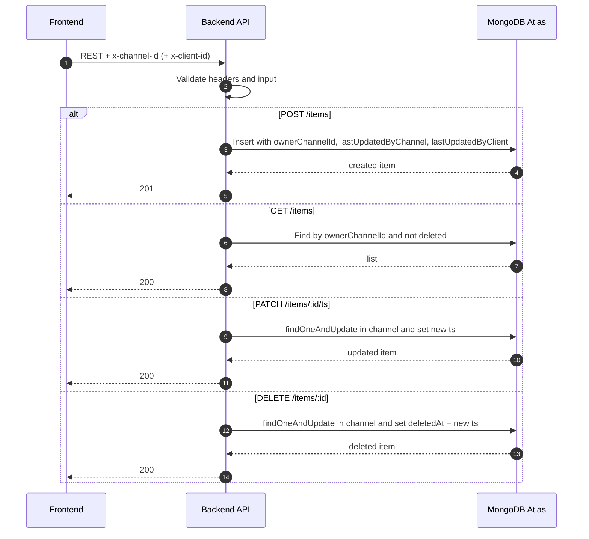
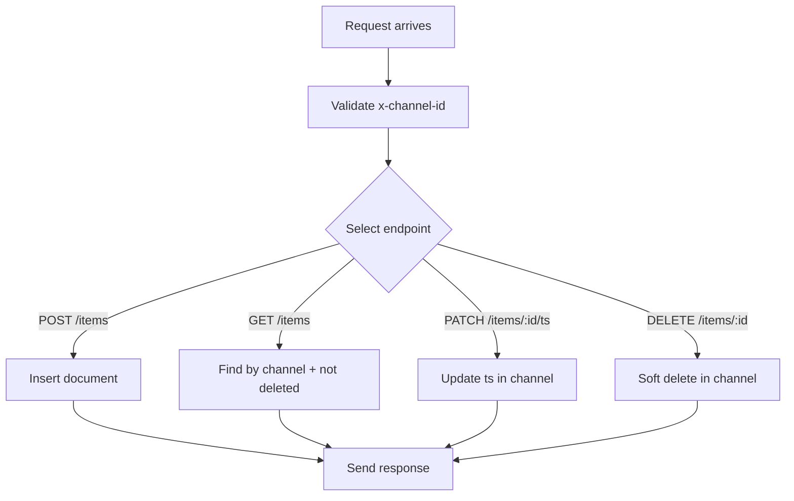

# สถาปัตยกรรม Backend Service

## Sequence Diagram

## Flowchart

## กติกา validation

- x-channel-id: ^0\\d{9}$
- x-client-id (ไม่บังคับ): ^[a-zA-Z0-9:_-]{6,120}$

## การรับประกันระดับข้อมูล

- ผู้ใช้เห็น/แก้ไขได้เฉพาะข้อมูลใน ownerChannelId เดียวกัน
- รายการที่ถูกลบ (deletedAt มีค่า) จะไม่ถูกส่งใน GET /items
