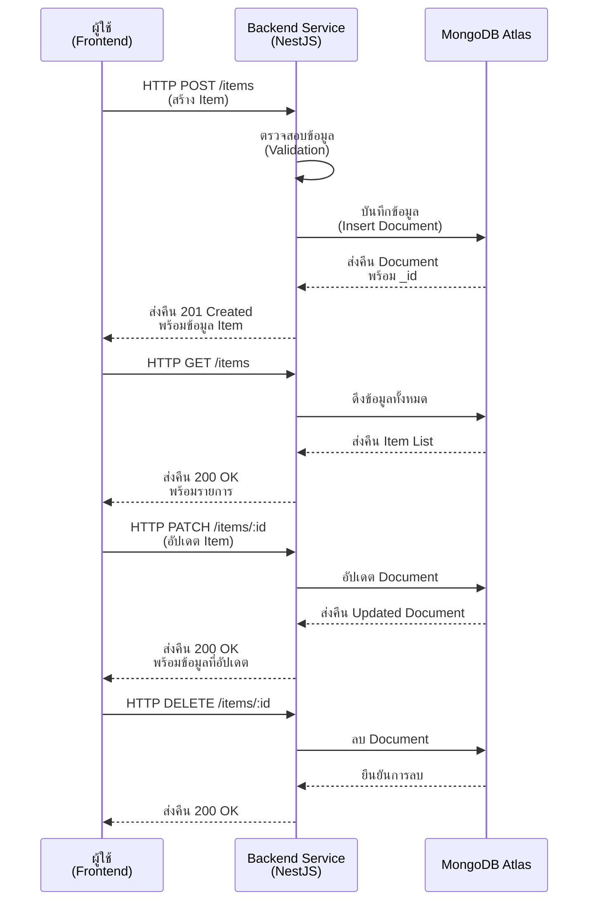
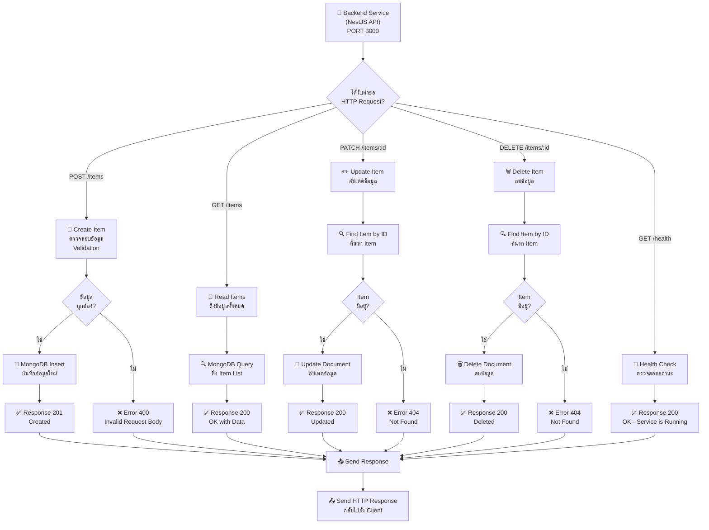

# Backend Service - สถาปัตยกรรมและแผนผังการทำงาน

## 📋 สารบัญ
1. [Sequence Diagram](#sequence-diagram)
2. [Flowchart](#flowchart)

---

## Sequence Diagram

### Backend Service - REST API Operations



**คำอธิบาย:**
- Backend Service เป็น NestJS API Server ที่ทำงานบน PORT 3000
- รับ HTTP Requests จาก Frontend สำหรับ CRUD Operations
- ตรวจสอบความถูกต้องของข้อมูลก่อนบันทึก
- บันทึก/อ่าน/อัปเดต/ลบ ข้อมูล ในคอลเลคชัน `items` ใน MongoDB Atlas
- ส่ง Response กลับไปยัง Frontend พร้อมข้อมูลหรือ Error Message

---

## Flowchart

### Backend Service - Request Processing Flow



**คำอธิบาย - Request Processing:**

1. **POST /items** (Create)
   - ตรวจสอบความถูกต้องของ Request Body
   - ถ้าถูกต้อง → Insert ลงใน MongoDB → Return 201 Created
   - ถ้าไม่ถูก → Return 400 Bad Request

2. **GET /items** (Read)
   - Query ดึงทั้งหมด Items จาก MongoDB
   - Return 200 OK พร้อมข้อมูล

3. **PATCH /items/:id** (Update)
   - ค้นหา Item by ID
   - ถ้ามี → Update Document → Return 200 OK
   - ถ้าไม่มี → Return 404 Not Found

4. **DELETE /items/:id** (Delete)
   - ค้นหา Item by ID
   - ถ้ามี → Delete Document → Return 200 OK
   - ถ้าไม่มี → Return 404 Not Found

5. **GET /health** (Health Check)
   - ตรวจสอบสถานะของ Service
   - Return 200 OK ถ้า Service ทำงานปกติ

---

## 📊 API Endpoints

| Method | Endpoint | ความสำคัญ | คำอธิบาย |
|--------|----------|-----------|----------|
| POST | `/items` | ⭐⭐⭐ | สร้าง Item ใหม่ |
| GET | `/items` | ⭐⭐⭐ | ดึงรายการ Items ทั้งหมด |
| GET | `/items/:id` | ⭐⭐ | ดึง Item เดี่ยว by ID |
| PATCH | `/items/:id` | ⭐⭐⭐ | อัปเดต Item |
| DELETE | `/items/:id` | ⭐⭐ | ลบ Item |
| GET | `/health` | ⭐ | ตรวจสอบสถานะ Service |

---

## 📝 Request/Response Examples

### Create Item (POST /items)

**Request:**
```json
{
  "name": "sensor-A",
  "description": "Temperature sensor in room A"
}
```

**Response (201 Created):**
```json
{
  "_id": "507f1f77bcf86cd799439011",
  "name": "sensor-A",
  "description": "Temperature sensor in room A",
  "createdAt": "2026-05-12T10:30:00.000Z",
  "updatedAt": "2026-05-12T10:30:00.000Z"
}
```

### Get All Items (GET /items)

**Response (200 OK):**
```json
[
  {
    "_id": "507f1f77bcf86cd799439011",
    "name": "sensor-A",
    "description": "Temperature sensor in room A",
    "createdAt": "2026-05-12T10:30:00.000Z",
    "updatedAt": "2026-05-12T10:30:00.000Z"
  },
  {
    "_id": "507f1f77bcf86cd799439012",
    "name": "sensor-B",
    "description": "Humidity sensor in room B",
    "createdAt": "2026-05-12T10:35:00.000Z",
    "updatedAt": "2026-05-12T10:35:00.000Z"
  }
]
```

### Update Item (PATCH /items/:id)

**Request:**
```json
{
  "name": "sensor-A",
  "description": "Updated temperature sensor"
}
```

**Response (200 OK):**
```json
{
  "_id": "507f1f77bcf86cd799439011",
  "name": "sensor-A",
  "description": "Updated temperature sensor",
  "createdAt": "2026-05-12T10:30:00.000Z",
  "updatedAt": "2026-05-12T10:45:00.000Z"
}
```

---

## 🛠️ Setup & Configuration

### Prerequisites
- Node.js 20+
- MongoDB Atlas (Replica Set Cluster)
- npm or yarn

### Installation
```bash
cd backend-service
npm install
```

### Configuration (.env)
```env
PORT=3000
MONGODB_URI=mongodb+srv://<username>:<password>@cluster0.xxxx.mongodb.net/realtime_event_system?retryWrites=true&w=majority
```

### Running
```bash
# Development
npm run start:dev

# Production
npm run build
npm run start:prod
```

---

## 📦 Project Structure

```
backend-service/
├── src/
│   ├── app.module.ts          # Main module
│   ├── main.ts                # Entry point
│   ├── items/
│   │   ├── items.module.ts    # Items module
│   │   ├── items.controller.ts # API endpoints
│   │   ├── items.service.ts   # Business logic
│   │   ├── dto/               # Data Transfer Objects
│   │   └── schemas/           # Mongoose schemas
│   └── common/                # Shared utilities
├── test/                      # E2E tests
├── package.json
├── tsconfig.json
└── nest-cli.json
```

---

**หมายเหตุ:** Backend Service เป็นส่วนที่จัดการ CRUD Operations และเชื่อมต่อกับ MongoDB Atlas โดยตรง
