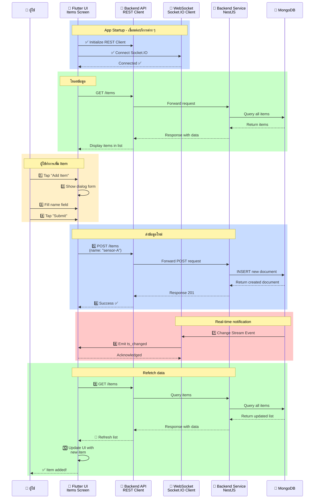
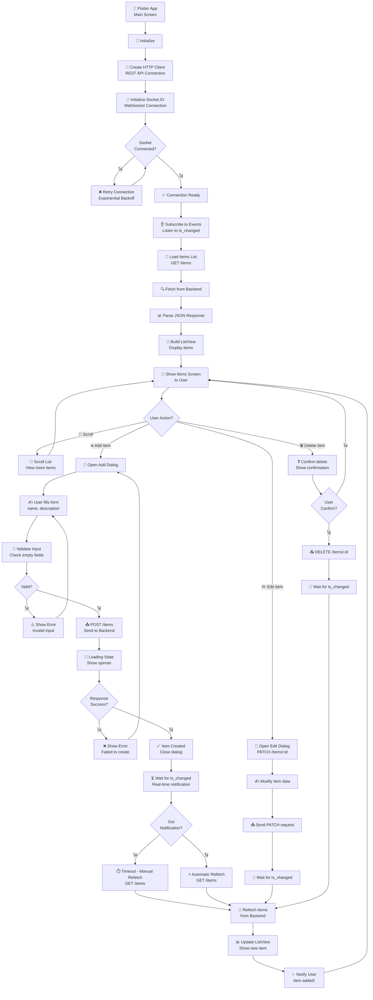

# Flutter Frontend - สถาปัตยกรรมและแผนผังการทำงาน

## 📋 สารบัญ
1. [Sequence Diagram](#sequence-diagram)
2. [Flowchart](#flowchart)

---

## Sequence Diagram

### Flutter Frontend - User Interaction & Real-time Updates



**คำอธิบาย:**
1. ผู้ใช้เปิด App → เชื่อมต่อ REST Client และ Socket.IO
2. โหลดข้อมูล Items จาก Backend
3. ผู้ใช้กด "Add Item" → เปิด Dialog Form
4. กรอกข้อมูล และ Submit
5. Flutter ส่ง POST /items ไปยัง Backend
6. Backend บันทึก ลง MongoDB
7. MongoDB Change Stream ส่ง Event ไปยัง Gateway
8. Gateway Emit `ts_changed` ไปยัง Flutter App
9. Flutter ได้รับการแจ้งเตือน และ GET /items เพื่อ Refetch
10. UI Update ด้วยข้อมูลล่าสุด

---

## Flowchart

### Flutter Frontend - User Interaction & Data Flow



**คำอธิบาย - User Interaction Flow:**

1. **Initialization**
   - สร้าง HTTP Client สำหรับ REST API
   - Initialize Socket.IO เชื่อมต่อ WebSocket
   - Subscribe ไปยัง `ts_changed` Event

2. **Load Data**
   - ส่ง GET /items ไปยัง Backend
   - Parse JSON Response
   - Build ListView แสดงข้อมูล

3. **Add Item Flow**
   - ผู้ใช้กด "Add Item"
   - เปิด Dialog Form
   - ตรวจสอบความถูกต้องของข้อมูล
   - ส่ง POST /items ไปยัง Backend
   - รอการแจ้งเตือน `ts_changed`
   - Refetch ข้อมูลล่าสุด
   - Update UI

4. **Edit Item Flow**
   - เปิด Edit Dialog
   - แก้ไขข้อมูล
   - ส่ง PATCH /items/:id
   - รอการแจ้งเตือน
   - Refetch และ Update

5. **Delete Item Flow**
   - ผู้ใช้เลือก Delete
   - แสดง Confirmation Dialog
   - ส่ง DELETE /items/:id
   - รอการแจ้งเตือน
   - Refetch และ Update

---

## 🎨 Widget Architecture

### Main Widget Tree

```
MyApp
├── MaterialApp
│   └── ItemsScreen
│       ├── AppBar
│       │   ├── Title: "Items"
│       │   └── FloatingActionButton: Add
│       ├── Body: ItemsList
│       │   └── ListView.builder
│       │       └── ItemTile (for each item)
│       │           ├── ListTile
│       │           ├── Edit Button
│       │           └── Delete Button
│       └── BottomNavigationBar
│
├── Dialogs
│   ├── AddItemDialog
│   │   ├── TextField: name
│   │   ├── TextField: description
│   │   ├── Button: Cancel
│   │   └── Button: Submit
│   ├── EditItemDialog
│   │   └── Similar to AddItemDialog
│   └── ConfirmDialog
│       ├── Text: "Delete?"
│       ├── Button: Cancel
│       └── Button: Confirm
│
└── Services
    ├── ApiService
    │   ├── createItem()
    │   ├── getItems()
    │   ├── updateItem()
    │   └── deleteItem()
    └── WebSocketService
        ├── connect()
        ├── disconnect()
        ├── subscribe()
        └── onTsChanged()
```

---

## 🔧 Service Classes

### ApiService (HTTP Client)

```dart
class ApiService {
  final String baseUrl = 'http://localhost:3000';
  
  Future<Item> createItem(String name, String description)
  Future<List<Item>> getItems()
  Future<Item> updateItem(String id, String name, String description)
  Future<void> deleteItem(String id)
}
```

### WebSocketService (Socket.IO Client)

```dart
class WebSocketService {
  final String socketUrl = 'http://localhost:3001';
  
  Future<void> connect()
  Future<void> disconnect()
  void subscribeToTsChanged(Function callback)
  void unsubscribeFromTsChanged()
}
```

---

## 📱 Screens

### Items List Screen

| Element | Purpose |
|---------|---------|
| AppBar | Header พร้อม Title และ Add Button |
| ListView | แสดงรายการ Items |
| ItemTile | Card แสดง Item พร้อม Edit/Delete |
| FloatingActionButton | ปุ่มเพิ่ม Item ใหม่ |
| SnackBar | แสดง Success/Error Messages |

### Add/Edit Item Dialog

| Element | Purpose |
|---------|---------|
| TextField: Name | รับข้อมูล Name |
| TextField: Description | รับข้อมูล Description |
| Submit Button | ส่งข้อมูล |
| Cancel Button | ยกเลิก |
| Validation | ตรวจสอบความถูกต้อง |

---

## 🛠️ Setup & Configuration

### Prerequisites
- Flutter 3+
- Dart 3+
- iOS/Android development environment

### Installation
```bash
cd frontend_flutter
flutter pub get
```

### Configuration

**lib/config/constants.dart:**
```dart
class Config {
  static const String apiBaseUrl = 'http://localhost:3000';
  static const String socketBaseUrl = 'http://localhost:3001';
  static const int connectTimeout = 30000; // ms
  static const int receiveTimeout = 30000; // ms
}
```

### Running

**Android Emulator:**
```bash
flutter run --dart-define=API_BASE_URL=http://10.0.2.2:3000 \
            --dart-define=SOCKET_BASE_URL=http://10.0.2.2:3001
```

**iOS Simulator:**
```bash
flutter run --dart-define=API_BASE_URL=http://localhost:3000 \
            --dart-define=SOCKET_BASE_URL=http://localhost:3001
```

**Web:**
```bash
flutter run -d web-server
```

---

## 📦 Project Structure

```
frontend_flutter/
├── lib/
│   ├── main.dart                    # Entry point
│   ├── config/
│   │   └── constants.dart          # Configuration
│   ├── models/
│   │   └── item.dart               # Item data model
│   ├── screens/
│   │   └── items_screen.dart       # Main screen
│   ├── widgets/
│   │   ├── item_tile.dart          # Item list tile
│   │   ├── add_item_dialog.dart    # Add dialog
│   │   └── dialogs.dart            # Other dialogs
│   ├── services/
│   │   ├── api_service.dart        # HTTP client
│   │   ├── websocket_service.dart  # Socket.IO client
│   │   └── item_service.dart       # Business logic
│   └── utils/
│       └── logger.dart             # Logging
├── test/
│   └── widget_test.dart            # Widget tests
├── pubspec.yaml                    # Dependencies
└── README.md
```

---

## 📦 Dependencies

**pubspec.yaml:**
```yaml
dependencies:
  flutter:
    sdk: flutter
  http: ^1.1.0                      # HTTP client
  socket_io_client: ^2.0.0          # Socket.IO client
  provider: ^6.0.0                  # State management
  json_serializable: ^6.0.0          # JSON serialization
  equatable: ^2.0.5                 # Value equality

dev_dependencies:
  flutter_test:
    sdk: flutter
  mockito: ^5.4.0                   # Mocking
```

---

## 🔄 State Management

### Using Provider Pattern

```dart
class ItemProvider extends ChangeNotifier {
  List<Item> items = [];
  bool isLoading = false;
  
  Future<void> loadItems() { ... }
  Future<void> createItem(Item item) { ... }
  Future<void> updateItem(Item item) { ... }
  Future<void> deleteItem(String id) { ... }
  
  void onTsChanged() {
    loadItems(); // Refetch when notified
  }
}
```

---

## ⚠️ Important Notes

✅ **HTTP Client Configuration**
- Use `10.0.2.2` instead of `localhost` for Android emulator
- iOS simulator can use `localhost`
- Web needs `http://localhost`

✅ **Socket.IO Connection**
- Automatic reconnection with exponential backoff
- Connection timeout: 30 seconds
- Keep-alive with ping/pong

✅ **Error Handling**
- Show user-friendly error messages
- Log errors for debugging
- Retry failed requests with exponential backoff

✅ **Real-time Updates**
- Listen to `ts_changed` event continuously
- Refetch data when notification received
- Debounce rapid updates (max 1 refetch per second)

---

**หมายเหตุ:** Flutter Frontend เป็น UI/UX Layer ที่ให้ผู้ใช้โต้ตอบกับระบบ และแสดงข้อมูลแบบ Real-time
