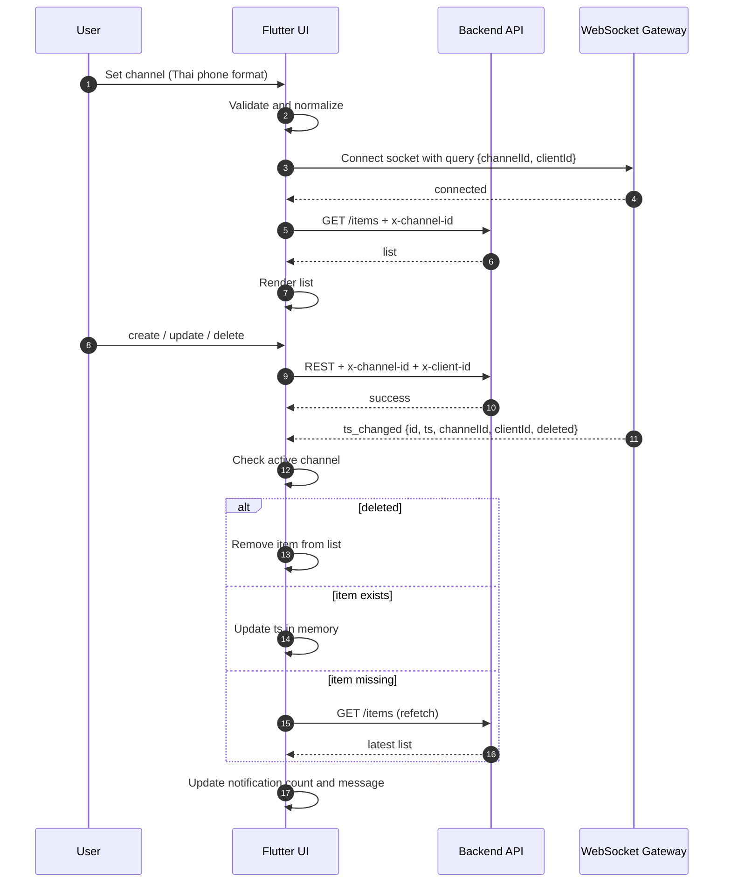
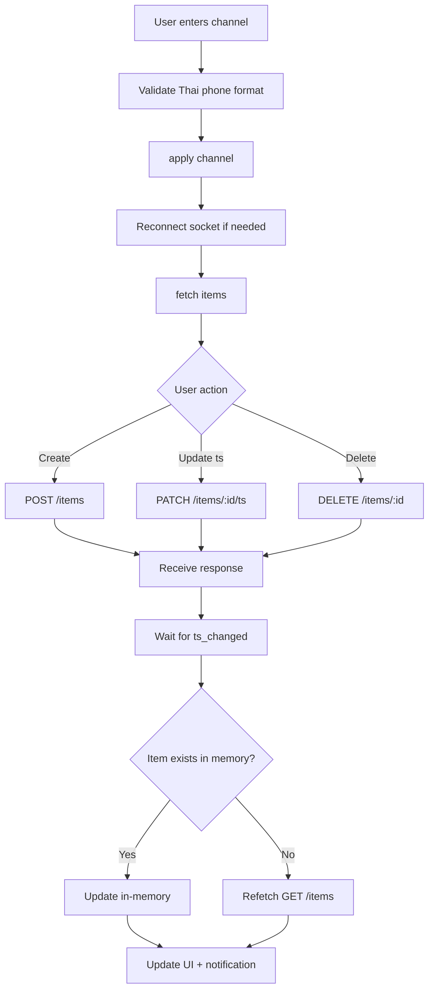

# สถาปัตยกรรม Flutter Frontend

## Sequence Diagram

## Flowchart

## สถานะสำคัญในแอป

- _channelId: channel ปัจจุบัน
- _socketChannelId: room ที่ socket ต่ออยู่จริง
- _clientId: id เครื่อง/แอปปัจจุบัน
- _isBackendConnected: สถานะ backend จากผล API
- _notificationCount: ตัวนับการแจ้งเตือน
