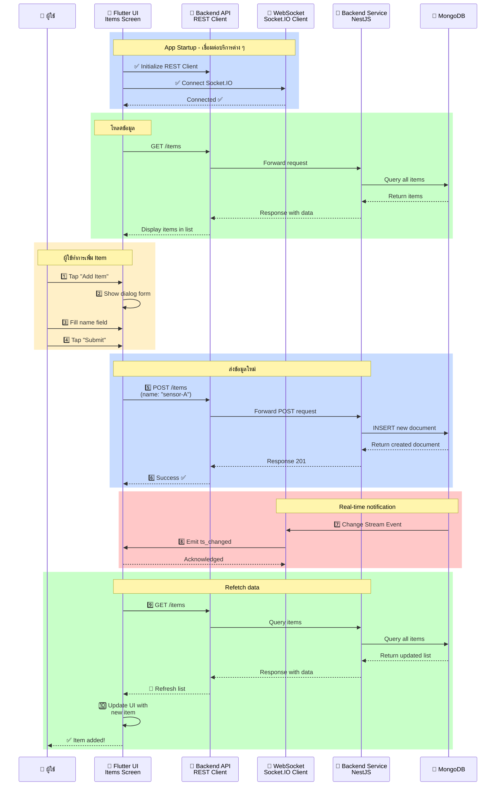
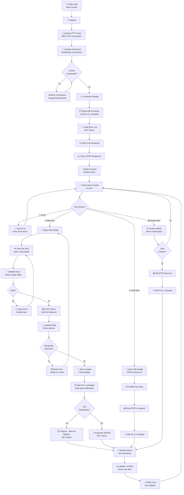

# Flutter Frontend - สถาปัตยกรรมและแผนผังการทำงาน

## 📋 สารบัญ
1. [Sequence Diagram](#sequence-diagram)
2. [Flowchart](#flowchart)

---

## Sequence Diagram

### Flutter Frontend - User Interaction & Real-time Updates



**คำอธิบาย:**
1. App เริ่มต้น → `initState`: `_fetchItems()` และ `_connectSocket()` พร้อมกัน
2. `_fetchItems()`: GET /items → parse JSON → render ListView
3. `_connectSocket()`: เชื่อมต่อ Gateway → ตั้ง listener `ts_changed`
4. ผู้ใช้พิมพ์ชื่อ และกด Create → `_createItem()`: POST /items → เคลียร input
5. `ts_changed` ถึง: ถ้า item ไม่อยู่ใน memory → `_fetchItems()` (refetch). ถ้าอยู่ → update ts in-memory
6. กด "Update ts" → `_refreshTs(id)`: PATCH /items/:id/ts → update item in-memory → fallback refetch ถ้า ts ไม่เปลี่ยน

---

## Flowchart

### Flutter Frontend - User Interaction & Data Flow



**คำอธิบาย - User Interaction Flow:**

1. **Initialization**
   - `initState`: `_fetchItems()` + `_connectSocket()` อัตโนมัติ

2. **Load Data**
   - `_fetchItems()`: GET /items → sort ตาม updatedAt desc → build ListView

3. **Create Item Flow**
   - ผู้ใช้พิมพ์ชื่อ และกด Create → `_createItem()`
   - POST /items { name } → 201 → clear input, แสดง notification
   - รอ event `ts_changed` จาก Gateway

4. **Refresh ts Flow**
   - กด "Update ts" → `_refreshTs(id)`: PATCH /items/:id/ts
   - อัปเดต item.ts ใน memory จาก response
   - ถ้า ts ไม่เปลี่ยน → fallback `_fetchItems()`

5. **ts_changed Handler**
   - ถ้า id ไม่อยู่ใน memory (item ใหม่) → `_fetchItems()` (refetch เพื่อดึง name)
   - ถ้าอยู่ใน memory → `_applyItemUpdate()` (update ts in-place)

---

## 🎨 Widget Architecture

### Main Widget Tree

```
RealtimeApp (StatelessWidget)
└── MaterialApp (title: 'Realtime ts Change Demo')
    └── RealtimeHomePage (StatefulWidget)
        └── Scaffold
            ├── AppBar
            │   ├── title: 'Realtime ts Change Demo'
            │   └── actions:
            │       ├── IconButton (notifications badge + count)
            │       └── IconButton (refresh)
            └── body: Padding
                └── Column
                    ├── Row
                    │   ├── TextField (item name)
                    │   └── FilledButton 'Create'
                    ├── LinearProgressIndicator (loading)
                    ├── Text (inline error, red)
                    └── Expanded
                        └── ListView.builder
                            └── Card > ListTile
                                ├── leading: Icon
                                ├── title: item.name
                                ├── subtitle: 'id: ..., ts: ...'
                                └── trailing: OutlinedButton 'Update ts'
```

---

## 🔧 State & Logic (lib/main.dart)

โค้ดทั้งหมดอยู่ในไฟล์เดียว `lib/main.dart` (ไม่แยก service/model)

| Class | ความbookรับผิดชอบ |
|-------|-------|
| `RealtimeApp` | MaterialApp root |
| `RealtimeHomePage` | StatefulWidget หลัก |
| `_RealtimeHomePageState` | state: items, socket, loading, error, notifications |
| `ItemRecord` | data class (`id`, `name`, `ts`) พร้อม `fromJson()` |

**เม็ธอดหลัก:**
- `_fetchItems()`: GET /items, `setState` อัปเดต `_items`
- `_createItem()`: POST /items, clear input เมื่อสำเร็จ
- `_refreshTs(id)`: PATCH /items/:id/ts, `_applyItemUpdate()` จาก response
- `_connectSocket()`: ตั้ง Socket.IO และ `ts_changed` handler
- `_applyItemUpdate(item)`: อัปเดต item ใน `_items` list in-place

---

## 📱 Screens

### Items List Screen

| Element | Purpose |
|---------|---------|
| AppBar | Header พร้อม Title และ Add Button |
| ListView | แสดงรายการ Items |
| ItemTile | Card แสดง Item พร้อม Edit/Delete |
| FloatingActionButton | ปุ่มเพิ่ม Item ใหม่ |
| SnackBar | แสดง Success/Error Messages |

### Add/Edit Item Dialog

| Element | Purpose |
|---------|---------|
| TextField: Name | รับข้อมูล Name |
| TextField: Description | รับข้อมูล Description |
| Submit Button | ส่งข้อมูล |
| Cancel Button | ยกเลิก |
| Validation | ตรวจสอบความถูกต้อง |

---

## 🛠️ Setup & Configuration

### Prerequisites
- Flutter 3+
- Dart 3+
- iOS/Android development environment

### Installation
```bash
cd frontend_flutter
flutter pub get
```

### Configuration

ค่า `apiBaseUrl` และ `socketBaseUrl` บันทึกเป็น `String.fromEnvironment` (ส่งผ่าน `--dart-define`):

```dart
const String apiBaseUrl = String.fromEnvironment(
  'API_BASE_URL',
  defaultValue: 'http://localhost:3000',
);
const String socketBaseUrl = String.fromEnvironment(
  'SOCKET_BASE_URL',
  defaultValue: 'http://localhost:3001',
);
const Duration apiTimeout = Duration(seconds: 8);
```

### Running

**Android Emulator:**
```bash
flutter run --dart-define=API_BASE_URL=http://10.0.2.2:3000 \
            --dart-define=SOCKET_BASE_URL=http://10.0.2.2:3001
```

**iOS Simulator:**
```bash
flutter run --dart-define=API_BASE_URL=http://localhost:3000 \
            --dart-define=SOCKET_BASE_URL=http://localhost:3001
```

**Web:**
```bash
flutter run -d web-server
```

---

## 📦 Project Structure

```
frontend_flutter/
├── lib/
│   └── main.dart   # โค้ดทั้งหมด (RealtimeApp, RealtimeHomePage, ItemRecord)
├── test/
│   └── widget_test.dart
├── pubspec.yaml
└── README.md
```

---

## 📦 Dependencies

**pubspec.yaml:**
```yaml
dependencies:
  flutter:
    sdk: flutter
  cupertino_icons: ^1.0.8
  http: ^1.6.0
  socket_io_client: ^3.1.4

dev_dependencies:
  flutter_test:
    sdk: flutter
  flutter_lints: ^5.0.0
```

---

## 🔄 State Management

ใช้ `StatefulWidget` + `setState` เป็น state management ไม่ใช้ Provider หรือ library ภายนอก

| State variable | ความหมาย |
|---------------|----------|
| `_items` | `List<ItemRecord>` รายการที่แสดงอยู่ |
| `_isLoading` | แสดง LinearProgressIndicator |
| `_error` | เป็น inline error message (null = no error) |
| `_updatingItemIds` | `Set<String>` id ที่กำลัง PATCH → disable button |
| `_notificationCount` | จำนวน ts_changed events ที่ได้รับ |
| `_lastNotification` | ข้อความ notification ล่าสุด |
| `_socket` | Socket.IO client instance |

---

## ⚠️ Important Notes

✅ **HTTP Client Configuration**
- Use `10.0.2.2` instead of `localhost` for Android emulator
- iOS simulator can use `localhost`
- Web needs `http://localhost`

✅ **Socket.IO Connection**
- `autoConnect: false` (connect ด้วย `socket.connect()` ใน `_connectSocket()`)
- Transport: websocket เท่านั้น
- ไม่มี ping/pong custom events (ใช้ Socket.IO built-in heartbeat)

✅ **Error Handling**
- แสดง user-friendly error message เป็น inline text (ไม่ใช่ dialog)
- รองรับ TimeoutException, SocketException, ClientException

✅ **Real-time Updates**
- เมื่อได้รับ `ts_changed`: update item in-memory (in-place)
- fallback `GET /items` เฉพาะเมื่อ item id ไม่อยู่ใน memory (หรือ ts ไม่เปลี่ยนหลัง PATCH)

---

**หมายเหตุ:** Flutter Frontend เป็น UI/UX Layer ที่ให้ผู้ใช้โต้ตอบกับระบบ และแสดงข้อมูลแบบ Real-time
