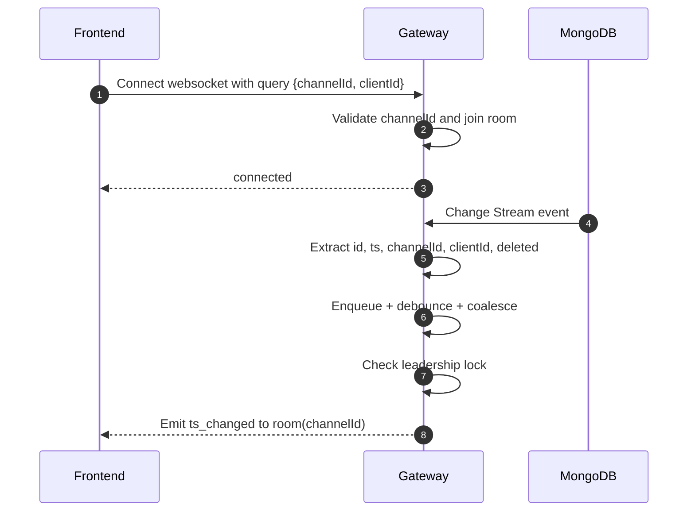

# สถาปัตยกรรม WebSocket Gateway

## Sequence Diagram



## Flowchart

```mermaid
flowchart TD
    A[Gateway startup] --> B[Watch Change Stream]
    B --> C[Acquire/renew leadership lock]
    C --> D[Accept socket connections]
    D --> E[Join room when channelId is valid]

    B --> F[Receive DB change]
    F --> G[Normalize payload]
    G --> H[Enqueue by item id]
    H --> I[debounce 50ms]
    I --> J{Is leader?}
    J -->|No| K[Skip flush]
    J -->|Yes| L[Emit ts_changed to room(channelId)]
    L --> M[Client receives realtime event]
```

## กติกาการ emit

- emit เฉพาะกรณี payload มี channelId
- ส่งไป room ที่ชื่อเดียวกับ channelId
- payload มี clientId เพื่อให้ frontend แยกข้อความเครื่องตัวเอง/เครื่องอื่น
