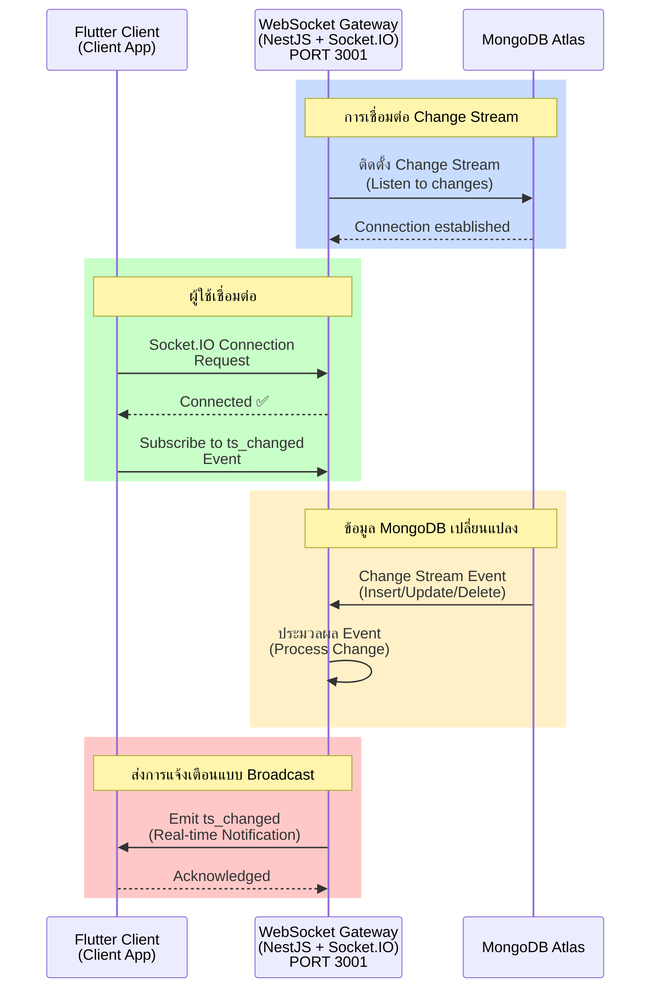
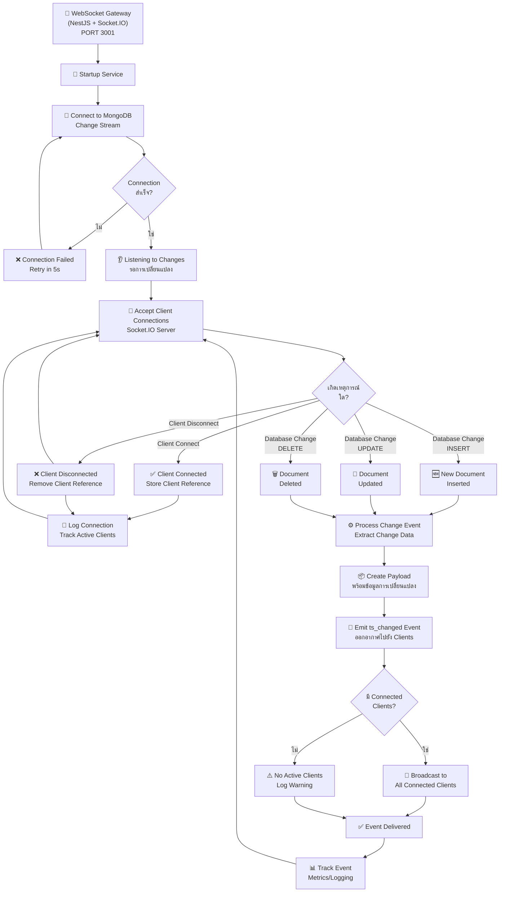

# WebSocket Gateway Service - สถาปัตยกรรมและแผนผังการทำงาน

## 📋 สารบัญ
1. [Sequence Diagram](#sequence-diagram)
2. [Flowchart](#flowchart)

---

## Sequence Diagram

### WebSocket Gateway Service - Change Stream & Real-time Events



**คำอธิบาย:**
- WebSocket Gateway ติดตั้ง MongoDB Change Stream เพื่อรับการแจ้งเตือนเมื่อข้อมูลเปลี่ยนแปลง
- Flutter Clients เชื่อมต่อผ่าน Socket.IO และรอการแจ้งเตือน `ts_changed`
- เมื่อมี Insert/Update/Delete ใน MongoDB Gateway จะประมวลผล Event และส่งไปยังทุก Connected Clients
- Clients ได้รับการแจ้งเตือนทันที และสามารถ refetch ข้อมูลจาก Backend

---

## Flowchart

### WebSocket Gateway Service - Change Detection & Broadcasting Flow



**คำอธิบาย - Change Detection & Broadcasting:**

1. **Startup & Connection**
   - เริ่มต้น WebSocket Gateway Service
   - เชื่อมต่อกับ MongoDB Change Stream
   - หากเชื่อมต่อล้มเหลว ให้ลองใหม่ทุก 5 วินาที

2. **Listen to Changes**
   - รอการเปลี่ยนแปลงข้อมูล (Insert/Update/Delete) จาก MongoDB
   - พร้อมสำหรับการรับการเชื่อมต่อจาก Clients

3. **Client Connection Management**
   - เมื่อ Client เชื่อมต่อ → บันทึกข้อมูล Reference
   - เมื่อ Client ตัดการเชื่อมต่อ → ลบข้อมูล Reference

4. **Change Event Processing**
   - ประมวลผล Change Event (Extract ข้อมูลที่เปลี่ยนแปลง)
   - สร้าง Payload พร้อมข้อมูลการเปลี่ยนแปลง

5. **Broadcasting**
   - Emit `ts_changed` Event ไปยังทุก Connected Clients
   - บันทึก Metrics/Logging สำหรับ Monitoring

---

## 🔌 Events & Handlers

### Supported Socket.IO Events

| Event | Direction | ความสำคัญ | คำอธิบาย |
|-------|-----------|-----------|----------|
| `connect` | Client → Server | ⭐⭐⭐ | Client เชื่อมต่อ |
| `disconnect` | Client → Server | ⭐⭐⭐ | Client ตัดการเชื่อมต่อ |
| `ts_changed` | Server → Client | ⭐⭐⭐ | ข้อมูลมีการเปลี่ยนแปลง |
| `subscribe` | Client → Server | ⭐⭐ | Subscribe ไปยัง Event |
| `unsubscribe` | Client → Server | ⭐⭐ | Unsubscribe จาก Event |
| `ping` | Client → Server | ⭐ | Heartbeat/Keep-alive |
| `pong` | Server → Client | ⭐ | Response to ping |

---

## 📝 Event Payload Examples

### ts_changed Event Payload

**When INSERT:**
```json
{
  "type": "INSERT",
  "operationType": "insert",
  "timestamp": "2026-05-12T10:30:00.000Z",
  "fullDocument": {
    "_id": "507f1f77bcf86cd799439011",
    "name": "sensor-A",
    "description": "Temperature sensor",
    "createdAt": "2026-05-12T10:30:00.000Z",
    "updatedAt": "2026-05-12T10:30:00.000Z"
  }
}
```

**When UPDATE:**
```json
{
  "type": "UPDATE",
  "operationType": "update",
  "timestamp": "2026-05-12T10:45:00.000Z",
  "documentKey": {
    "_id": "507f1f77bcf86cd799439011"
  },
  "updateDescription": {
    "updatedFields": {
      "name": "sensor-A-updated",
      "updatedAt": "2026-05-12T10:45:00.000Z"
    },
    "removedFields": []
  }
}
```

**When DELETE:**
```json
{
  "type": "DELETE",
  "operationType": "delete",
  "timestamp": "2026-05-12T10:50:00.000Z",
  "documentKey": {
    "_id": "507f1f77bcf86cd799439011"
  }
}
```

---

## 🛠️ Setup & Configuration

### Prerequisites
- Node.js 20+
- MongoDB Atlas (Replica Set - Required for Change Streams)
- npm or yarn

### Installation
```bash
cd websocket-gateway-service
npm install
```

### Configuration (.env)
```env
PORT=3001
MONGODB_URI=mongodb+srv://<username>:<password>@cluster0.xxxx.mongodb.net/realtime_event_system?retryWrites=true&w=majority
NODE_ENV=development
LOG_LEVEL=debug
```

### Running
```bash
# Development
npm run start:dev

# Production
npm run build
npm run start:prod
```

---

## 📊 Monitoring & Logging

### Connection Metrics
- Total Connected Clients
- Connection Uptime
- Change Stream Event Count
- Failed Broadcasts
- Latency (Event Detection → Client Notification)

### Key Logs
```
[WebSocketGateway] Initialized
[ChangeStream] Connected to MongoDB
[ChangeStream] Listening for changes...
[Client] Client connected: socket-id-xxxxx
[Change] INSERT detected in items collection
[Broadcast] ts_changed emitted to 5 clients
[Client] Client disconnected: socket-id-xxxxx
```

---

## 📦 Project Structure

```
websocket-gateway-service/
├── src/
│   ├── app.module.ts           # Main module
│   ├── main.ts                 # Entry point
│   ├── realtime/
│   │   ├── realtime.gateway.ts # Socket.IO gateway
│   │   ├── realtime.service.ts # Change Stream logic
│   │   ├── realtime.module.ts  # Realtime module
│   │   └── dto/                # Data Transfer Objects
│   └── common/
│       ├── config/             # Configuration
│       └── logger/             # Logging utilities
├── test/                       # E2E tests
├── package.json
├── tsconfig.json
└── nest-cli.json
```

---

## ⚠️ Important Notes

✅ **MongoDB Replica Set Required**
- Change Streams ต้องการ MongoDB Replica Set
- Atlas ตั้งค่าให้สูงสุด 3 nodes

✅ **Network Access**
- Ensure IP whitelisting ใน MongoDB Atlas
- Gateway Service ต้องสามารถเชื่อมต่อ MongoDB

✅ **Socket.IO Configuration**
- CORS enabled สำหรับ Flutter web
- Connection timeout: 60 seconds
- Reconnection attempts: auto with exponential backoff

✅ **High Availability**
- Multiple Gateway instances สามารถทำได้โดยใช้ Redis adapter
- Redis เพื่อ shared event broadcasting

---

**หมายเหตุ:** WebSocket Gateway Service เป็นส่วนที่จัดการการส่งการแจ้งเตือนแบบ Real-time ไปยัง Clients ผ่าน Socket.IO
