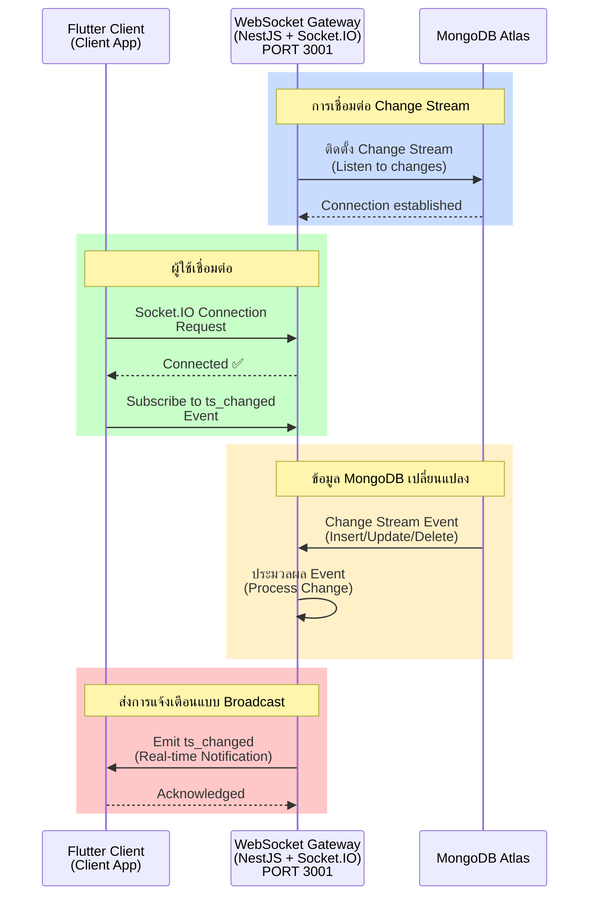
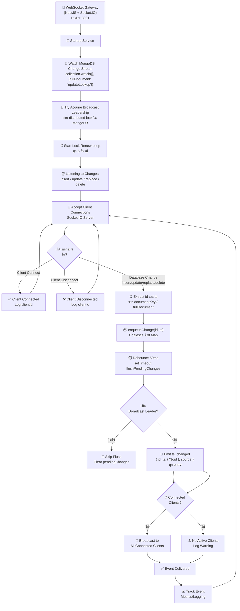

# WebSocket Gateway Service - สถาปัตยกรรมและแผนผังการทำงาน

## 📋 สารบัญ
1. [Sequence Diagram](#sequence-diagram)
2. [Flowchart](#flowchart)

---

## Sequence Diagram

### WebSocket Gateway Service - Change Stream & Real-time Events



**คำอธิบาย:**
- WebSocket Gateway ติดตั้ง MongoDB Change Stream เพื่อรับการแจ้งเตือนเมื่อข้อมูลเปลี่ยนแปลง
- Flutter Clients เชื่อมต่อผ่าน Socket.IO และรอการแจ้งเตือน `ts_changed`
- เมื่อมี Insert/Update/Delete ใน MongoDB Gateway จะประมวลผล Event และส่งไปยังทุก Connected Clients
- Clients ได้รับการแจ้งเตือนทันที และสามารถ refetch ข้อมูลจาก Backend

---

## Flowchart

### WebSocket Gateway Service - Change Detection & Broadcasting Flow



**คำอธิบาย - Change Detection & Broadcasting:**

1. **Startup**
   - เริ่มต้น WebSocket Gateway Service
   - Watch MongoDB Change Stream บน collection `items` (fullDocument: updateLookup)
   - ลอง Acquire Broadcast Leadership ผ่าน distributed lock ใน MongoDB
   - เริ่ม loop ต่ออายุ lock ทุก 5 วินาที

2. **Listen to Changes**
   - รับ operation types: insert, update, replace, delete
   - Extract `id` จาก `documentKey._id` และ `ts` จาก `fullDocument.ts` (หรือ fallback เป็น id)

3. **Debounce & Coalescing**
   - enqueue change เข้า `Map<id, ts>` (ถ้า id เดิมมาซ้ำ จะ overwrite ด้วย ts ล่าสุด)
   - flush หลัง debounce 50ms

4. **Broadcast Leadership**
   - เฉพาะ instance ที่เป็น leader เท่านั้นที่ broadcast ได้ (ป้องกัน duplicate กรณีหลาย instance)

5. **Broadcasting**
   - Emit `ts_changed { id, ts: { $oid }, source }` ไปยังทุก Connected Clients ด้วย `server.emit()`

---

## 🔌 Events & Handlers

### Supported Socket.IO Events

| Event | Direction | คำอธิบาย |
|-------|-----------|----------|
| `connect` | Client → Server | Client เชื่อมต่อ (Socket.IO built-in) |
| `disconnect` | Client → Server | Client ตัดการเชื่อมต่อ (Socket.IO built-in) |
| `ts_changed` | Server → Client | Gateway broadcast เมื่อข้อมูลใน MongoDB เปลี่ยนแปลง |

---

## 📝 Event Payload Examples

### ts_changed Event Payload

ทุก operation type (insert/update/replace/delete) ใช้ payload รูปแบบเดียวกัน:

```json
{
  "id": "507f1f77bcf86cd799439011",
  "ts": { "$oid": "6820e4f9a3b1c2d4e5f60790" },
  "source": "12345-550e8400-e29b-41d4-a716-446655440000"
}
```

| Field | Type | คำอธิบาย |
|-------|------|----------|
| `id` | string (24-char hex) | `_id` ของ item ที่เปลี่ยนแปลง |
| `ts` | `{ $oid: string }` | ObjectId ของ ts ล่าสุด |
| `source` | string | `{pid}-{uuid}` ของ gateway instance ที่ broadcast |

---

## 🛠️ Setup & Configuration

### Prerequisites
- Node.js 20+
- MongoDB Atlas (Replica Set - Required for Change Streams)
- npm or yarn

### Installation
```bash
cd websocket-gateway-service
npm install
```

### Configuration (.env)
```env
PORT=3001
MONGODB_URI=mongodb+srv://<username>:<password>@cluster0.xxxx.mongodb.net/realtime_event_system?retryWrites=true&w=majority
```

### Running
```bash
# Development
npm run start:dev

# Production
npm run build
npm run start:prod
```

---

## 📊 Monitoring & Logging

### Connection Metrics
- Total Connected Clients
- Connection Uptime
- Change Stream Event Count
- Failed Broadcasts
- Latency (Event Detection → Client Notification)

### Key Logs
```
[WebSocketGateway] Initialized
[ChangeStream] Connected to MongoDB
[ChangeStream] Listening for changes...
[Client] Client connected: socket-id-xxxxx
[Change] INSERT detected in items collection
[Broadcast] ts_changed emitted to 5 clients
[Client] Client disconnected: socket-id-xxxxx
```

---

## 📦 Project Structure

```
websocket-gateway-service/
├── src/
│   ├── app.module.ts           # Main module
│   ├── main.ts                 # Entry point (PORT 3001)
│   └── realtime/
│       ├── realtime.gateway.ts # Socket.IO gateway (handleConnection/Disconnect, broadcastTsChanged)
│       ├── change-stream.service.ts # MongoDB Change Stream + debounce + broadcast leadership
│       └── realtime.module.ts  # Realtime module
├── test/                       # E2E tests
├── package.json
├── tsconfig.json
└── nest-cli.json
```

---

## ⚠️ Important Notes

✅ **MongoDB Replica Set Required**
- Change Streams ต้องการ MongoDB Replica Set
- Atlas ตั้งค่าให้สูงสุด 3 nodes

✅ **Network Access**
- Ensure IP whitelisting ใน MongoDB Atlas
- Gateway Service ต้องสามารถเชื่อมต่อ MongoDB

✅ **Socket.IO Configuration**
- CORS enabled สำหรับ Flutter web
- Connection timeout: 60 seconds
- Reconnection attempts: auto with exponential backoff

✅ **High Availability**
- รองรับหลาย Gateway instances พร้อมกันโดยใช้ distributed lock ใน MongoDB (`realtime_broadcast_locks`)
- เฉพาะ instance ที่เป็น leader (lock holder) เท่านั้นที่ broadcast ป้องกัน duplicate events

---

**หมายเหตุ:** WebSocket Gateway Service เป็นส่วนที่จัดการการส่งการแจ้งเตือนแบบ Real-time ไปยัง Clients ผ่าน Socket.IO
